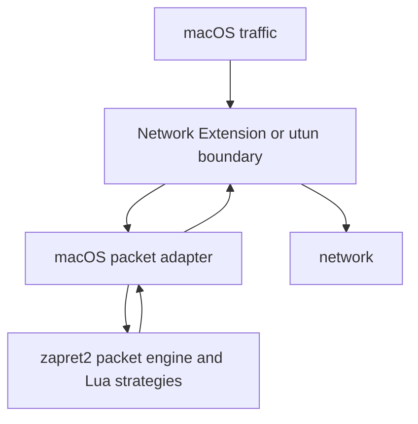

# macOS Native Backend Notes

`zapret2` does not currently have a complete native macOS packet backend. The macOS menu app is now being moved away from the old `zapret` v1 `tpws + pf` compatibility layer toward a real zapret2 backend.

The development scaffold lives in `extras/macos-native`. It does not claim traffic interception is ready yet; it exists to make the boundary explicit and prevent the old runtime from being mistaken for the new engine.

This document describes what would be required for a true native `zapret2` backend on macOS.

## Current Cross-Platform Model

`zapret2` needs an operating-system boundary that can:

- select packets in kernel or system networking code;
- pass selected packets to a userspace process;
- let `nfqws2`, `dvtws2`, or `winws2` inspect and modify them;
- reinject or forward the result without creating routing loops.

Existing supported systems provide that boundary differently:

- Linux: Netfilter Queue, driven by `nfqws2`.
- FreeBSD/OpenBSD: divert sockets or `pf divert-packet`, driven by `dvtws2`.
- Windows: WinDivert, driven by `winws2`.

macOS is different. Apple removed the classic BSD `ipdivert` mechanism, and macOS `pf` does not provide a compatible replacement for the `dvtws2` flow.

## Why the BSD Path Is Not Enough

The BSD implementation is useful as a reference for packet processing, but it is not a working Darwin backend by itself:

- `dvtws2` expects a divert-capable kernel boundary.
- FreeBSD examples use `ipfw divert`.
- OpenBSD examples use `pf divert-packet`.
- macOS has `pf`, but not the required `ipdivert` behavior for this design.

Compiling a Darwin binary would not solve the missing packet boundary. A binary without a way to receive and reinject selected packets cannot provide transparent DPI bypass.

## Candidate Native Designs

### Network Extension

The most Apple-native option is a Network Extension, likely a Packet Tunnel Provider or a closely related filtering design.

Benefits:

- supported Apple API surface;
- can own a packet boundary without relying on removed BSD features;
- closer to the role that WinDivert or Netfilter Queue plays on other platforms.

Costs and risks:

- requires Apple developer signing and entitlements;
- distribution, notarization, and installation become more complex;
- packet routing, MTU, DNS, sleep/wake, and battery behavior need careful testing;
- `nfqws2` would need an adapter for packets supplied by the extension rather than Netfilter Queue or divert sockets.

### utun or Full-Tunnel Design

Another option is a virtual interface/full-tunnel approach.

Benefits:

- conceptually clear packet ownership;
- does not depend on `pf divert-packet`.

Costs and risks:

- heavier operational model;
- route management is intrusive;
- all-traffic tunnel behavior can affect VPNs, DNS, local networking, battery usage, and sleep/wake.

### Local Proxy Mode

A local proxy can be useful for some applications, but it is not equivalent to native transparent `zapret2` support.

Benefits:

- easier to ship;
- can avoid kernel packet interception.

Costs and risks:

- only works for applications configured to use the proxy;
- does not cover arbitrary TCP/UDP traffic transparently;
- does not match the main `zapret2` architecture.

## Suggested Native Architecture

The key new component is the macOS packet adapter. It would translate between Apple-provided packet buffers and the `zapret2` packet processing model.

## Implementation Milestones

1. Build a minimal packet boundary proof of concept for macOS.
2. Feed captured packets into a small adapter without `nfqws2` changes.
3. Define a stable internal packet API that can be shared by Netfilter Queue, divert sockets, WinDivert, and macOS.
4. Wire the adapter into `nfqws2` Lua strategy execution.
5. Add loop prevention, filtering, DNS behavior, sleep/wake recovery, and status reporting.
6. Package the backend with signing and installation documentation.

## Compatibility Layer Position

`extras/macos-menu` is the user-facing macOS controller. It should not own packet processing. Its job is to start, stop, update, and diagnose the native backend once the Network Extension adapter is implemented.
